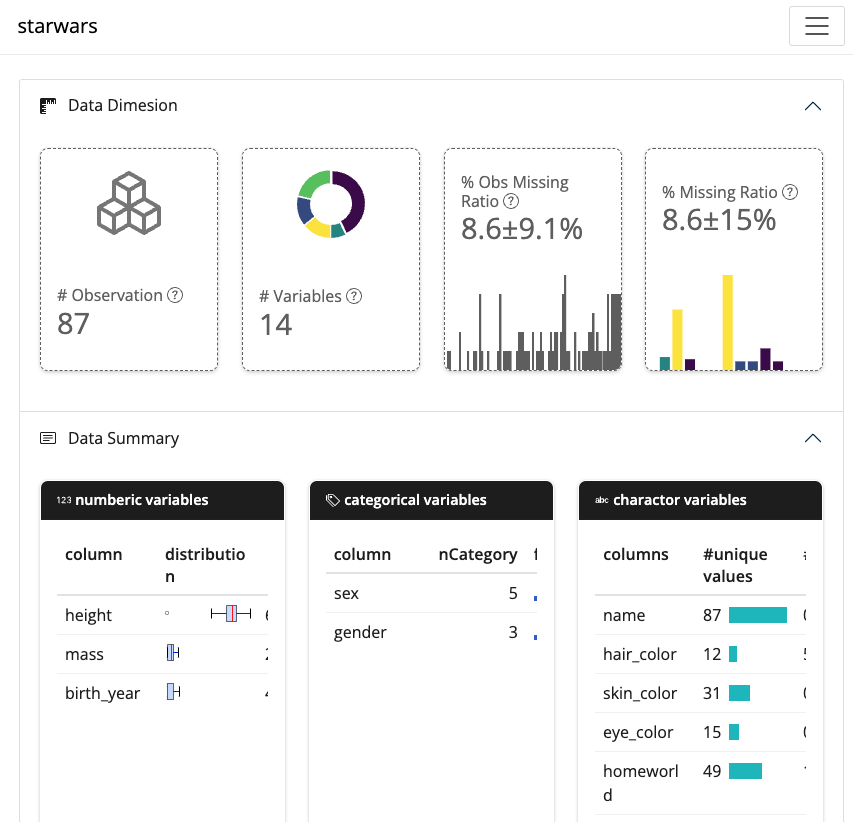
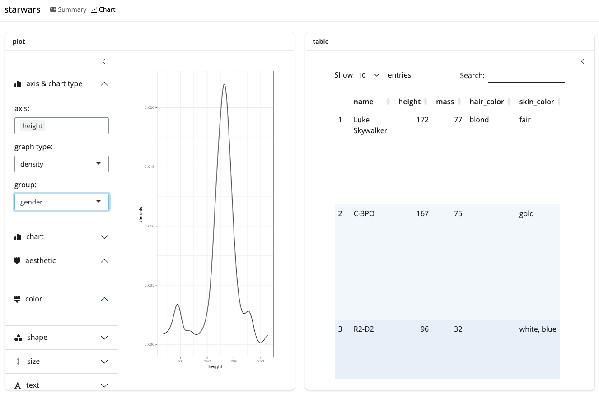

<center>

# CodeRbook 


BYUNG-JU KIM Ph.D.  
Genomic data scientist
</center>

## Introduction

CodeRbook is an interactive exploratory data analysis (EDA) tool based on Shiny/BSLIB.

## Installation

- the package is under development. only development version is available.
- some dependency may not available in CRAN. please check it and install it manually.

```r
remotes::install_github("airbj31/codebook")
```

## Usage

### describe_df

This function makes summary statistics for given data.

```r 
describe_df(starwars)
```

```
# Rows: 87 (avg missing ratio: 8.6 ± 9.1 %)
# Cols: 14 (avg missing ratig: 8.6 ± 15 %)
# suggesting $col_type_strings for reading data:  cincccnffcclll 
$df_summary# :
# A tibble: 14 × 4
   columns    col_type  n_uniq_Val nMISS
   <chr>      <chr>          <int> <int>
 1 name       character         87     0
 2 height     integer           46     6
 3 mass       numeric           39    28
 4 hair_color character         12     5
 5 skin_color character         31     0
 6 eye_color  character         15     0
 7 birth_year numeric           37    44
 8 sex        factor             5     4
 9 gender     factor             3     4
10 homeworld  character         49    10
11 species    character         38     4
12 films      list               7     0
13 vehicles   list              10     0
14 starships  list              15     0
 # $numeric_data_summary :
# A tibble: 3 × 9
    idx column      Min.   QT1 Median  Mean   QT3  Max. nMISS
  <dbl> <chr>      <dbl> <dbl>  <dbl> <dbl> <dbl> <dbl> <dbl>
1     2 height        66 167      180 175.  191     264     6
2     3 mass          15  55.6     79  97.3  84.5  1358    28
3     7 birth_year     8  35       52  87.6  72     896    44
# $category_column_summary:
       We have  2  elements with total 6 categories
       
```

### codebook

Run interactive html session

```r
codebook(starwars)
```




### Dependency

some packages are not in CRAN. please install them separately in the case.

- [shiny](https://github.com/rstudio/shiny)
- [bslib >= 0.5.1](https://github.com/rstudio/bslib)
- [plotly](https://github.com/plotly/plotly.R)
- [tidyverse](https://github.com/rstudio/tidyverse)
- [bsicons](https://github.com/rstudio/bsicons)
- [fontawesome](https://github.com/rstudio/fontawesome)
- [reactable](https://github.com/reactable/)
- [sparklines](https://github.com/Bart6114/sparklines)

<!--
- [ggworldcloud](https://github.com/lepennec/ggwordcloud)
-->

## Notes & TODO

- This package is under development. we will apply interactivility between table and plot.
- currently, chart section is under development. some part works and the others doesn't.  
  e.g.) 3d plot is not available at the moment.
- [ ] finishing chart section 
- [ ] add interactivity between plot and table
